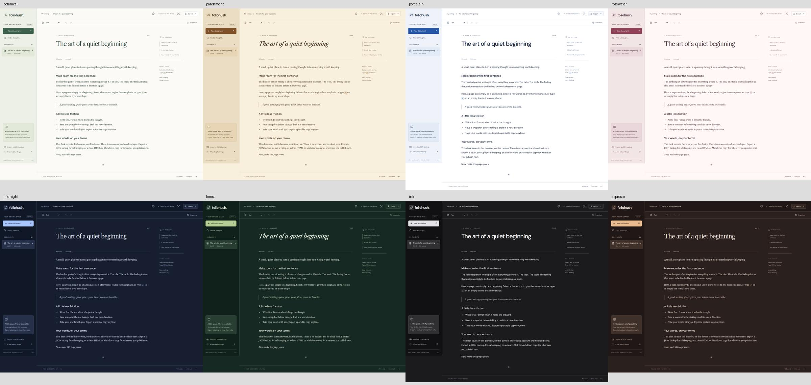

# Foliohush

**A quieter place to put your next thought.**

Foliohush is a local-first writing app with an editorial layout, thoughtful typography, and a focused React editor. Write a draft, keep a few turning points, and take your words with you as JSON, Markdown, or HTML.

[简体中文](docs/README.zh-CN.md) · [Русский](docs/README.ru.md) · [Deutsch](docs/README.de.md)

[Live demo](https://loufengzh.github.io/foliohush/) · [GitHub](https://github.com/loufengzh/foliohush) · [CI](https://github.com/loufengzh/foliohush/actions/workflows/ci.yml) · [Mobile screenshot](docs/screenshots/mobile.png)


## What is here

- **A comfortable writing desk.** A structured document library and title search, heading outline, focus mode, word count, and estimated reading time. Primary controls have 44 px targets, the main UI uses 15–16 px text, and the writing body uses 18 px text. Titles grow with their content.
- **Formatting where you need it.** Bold and Italic stay available in the document toolbar. Select text for the floating toolbar with bold, italic, strikethrough, highlight, inline code, and links. Use the block selector or type `/` on an empty paragraph for headings, lists, quotes, code blocks, and dividers.
- **Your own version checkpoints.** Save named snapshots and restore an earlier draft. A restore first saves the current draft as a recovery snapshot. Each document retains its latest 12 snapshots.
- **Browser-local autosave.** Documents and snapshots are stored together in `localStorage`. Storage errors are surfaced and incompatible stored data is not silently overwritten. Expected stored bytes are checked before each write; Web Locks serialize cooperating tabs where supported. Detected conflicts pause saving.
- **Portable copies.** JSON preserves a document and its snapshots. Markdown and HTML are reading/publishing exports. Validated JSON imports always create a new document. When saving fails, an emergency TXT export can preserve the current editor text.
- **A reusable editor in source.** `FolioEditor` is a React component with typed callbacks, configurable placeholder text, and an editable/read-only mode.

This is one application repository, not a published npm component package. The interface is currently English; the translated READMEs document the same app.

## Run locally

Use Node.js **22.12 or newer** and npm. Node 24 is used by the included CI workflow.

From the repository directory:

```sh
npm ci
npm run dev
```

Open the local URL printed by Vite, normally `http://127.0.0.1:5173`. No account, API key, or backend is required. Dependencies are needed for installation; fonts are bundled locally through Fontsource rather than requested from a font CDN at runtime.

For a production build:

```sh
npm run build
npm run preview
```

The build is written to `dist/`. Serve that directory from a static web host; `npm run preview` is a local build check, not a production server. Keep the host, scheme, and port consistent if you want to keep using the same browser storage.

## A small writing guide

1. Choose **New document**, then give the page a title.
2. Write normally. Use **Bold** and **Italic** in the document toolbar, or select words to reveal the floating formatting bar.
3. Type `/` at the beginning of an empty paragraph to choose a block. Filter by name, use the arrow keys, press Enter to insert, or Escape to dismiss.
4. Open **Snapshots** before a large revision. Name the moment and choose **Save snapshot**.
5. Use **Export → Full-fidelity backup** to download a JSON copy of the current document and its snapshots. Repeat for each document you want to preserve.
6. Choose **Import a JSON backup** to bring an exported document back as a separate draft.

Useful shortcuts:

| Action            | Shortcut                  |
| ----------------- | ------------------------- |
| Bold              | Ctrl/⌘ + B                |
| Italic            | Ctrl/⌘ + I                |
| Undo              | Ctrl/⌘ + Z                |
| Toggle focus mode | Ctrl/⌘ + Shift + F        |
| Open block menu   | `/` on an empty paragraph |

The word count splits text on whitespace. Reading time uses roughly 220 words per minute, with a minimum of one minute; both are estimates, especially for languages without spaces between words.

## Keep a copy outside the browser

**Browser storage is not a backup. Clearing site data removes your drafts and snapshots. There is no account, cloud sync, or server-side recovery.** A different browser, profile, device, host, or port has a different workspace. Private browsing and browser storage policies can also limit retention.

- Export important documents as JSON regularly and store those files somewhere you control. Exports cover one document at a time, not the whole library.
- Snapshots share the same browser storage as the draft. They help with revisions, not device loss or cleared site data. Creating a thirteenth snapshot removes the oldest retained snapshot, including when restoring creates a recovery snapshot.
- If the app says **Not saved** or displays a storage warning, export your work before closing or reloading. **Export → Emergency plain text** downloads the current editor text as TXT when the document is unsaved; it omits formatting and snapshots. The app does not promise to retry a paused save automatically.
- Avoid editing the same workspace in multiple tabs. The app checks that storage still matches the bytes it last read or saved and uses `navigator.locks` to serialize cooperating tabs when available. Without Web Locks, this is an optimistic comparison only and a concurrent-write race remains possible. Conflicts pause saving; edits are never automatically merged.
- Writing in an already-loaded tab does not require a network connection. There is no service worker or installable PWA support, so opening or reloading a hosted copy while offline is not guaranteed.
- Local documents and downloaded backups are not encrypted by Foliohush. Other software with access to the browser profile or downloaded files may be able to read them.

## Scope and limits

Foliohush is for **text-based writing**. It includes paragraphs, headings 1–3, bullet/numbered lists, quotes, code blocks, horizontal rules, and inline formatting. It intentionally does not include images, file attachments, tables, embeds, collaboration, publishing accounts, bundled AI services, or Markdown/HTML file import. An optional self-hosted AI gateway is described below. The current UI also has no document deletion or whole-workspace export.

The workspace holds up to **50 documents**, with **12 snapshots per document**. The stored workspace and each JSON import/export are limited to **4 MiB**. Browser quotas may be lower, and snapshots count toward the workspace size. These are safety bounds, not a promise that editing near the limits will be fast.

The editor validates document-changing transactions before committing them. Unsupported edits are rejected with a notice rather than becoming an unsavable draft. JSON import accepts only the versioned Foliohush format. It validates known nodes and attributes, bounds content complexity, and permits only absolute `http:`, `https:`, and `mailto:` links. This reduces risk; it does not certify that a linked destination is trustworthy. Imported document identity is regenerated so a file cannot target an existing draft.

Markdown export preserves text but cannot represent every rich-text detail. In particular, underline and highlight become plain text, and alphabetic/Roman ordered-list markers become numbers. Zero-based ordered lists and the safe marker types `1`, `a`, `A`, `i`, and `I` are supported in the document format; JSON and HTML preserve them. HTML preserves supported text formatting in an unstyled standalone page. Neither format contains snapshots or can be re-imported through the app. Use JSON for a restorable backup.

## For developers

```sh
npm run typecheck
npm test
npm run build
npx playwright install chromium
npm run test:e2e
```

On Linux, Playwright may also need system dependencies (`npx playwright install --with-deps chromium`). The [verified CI run](https://github.com/loufengzh/foliohush/actions/runs/37284170780) passed all 24 desktop/mobile-emulated Chromium tests at commit `b435db1`. The live demo also received desktop selection, link, and reload checks; desktop/mobile screenshots were visually reviewed. See the [verification record](docs/verification.md) for scope and remaining coverage. Later commits require their own passing CI run. Target-size, assistant-overflow, and screenshot regression coverage is being added for the workspace redesign; these historical results do not verify it.

- [Architecture and editor integration](docs/architecture.md): component API, document schema, persistence, and extension boundaries
- [Verification record](docs/verification.md): tested revisions, browser coverage, and remaining QA
- [Contributing](CONTRIBUTING.md): development workflow and review expectations
- [Security](SECURITY.md): threat boundaries and reporting guidance
- [Third-party notices](THIRD_PARTY_NOTICES.md): dependency and font attribution

## Built on good foundations

The original application shell, styling, slash-command UI, snapshot workflow, validation, and export code live in this repository. The underlying editor is [Tiptap](https://tiptap.dev), built on [ProseMirror](https://prosemirror.net). React provides the UI runtime; Vite provides the development/build tools; Lucide supplies icons; DM Sans and Libre Caslon Text are distributed through Fontsource.

Foliohush draws on the familiar, spacious feel of editorial writing tools. It is not affiliated with Medium and does not use Medium branding or claim ownership of upstream editor technology.

## License

Original project code is [MIT licensed](LICENSE), copyright 2026 loufengzh. Dependencies and bundled fonts retain their own licenses; see [Third-party notices](THIRD_PARTY_NOTICES.md).

## Eight atmospheres, one writing desk



[Mobile theme gallery](docs/screenshots/themes-mobile.jpg)

Open the labeled **Appearance** control in the top bar to preview and select **Botanical**, **Parchment**, **Porcelain**, **Rosewater**, **Midnight**, **Forest**, **Ink**, or **Espresso**. Four light and four dark palettes cover the entire desk, including formatting menus, dialogs, links, code, highlights, and focus indicators. Parchment and Forest use an italic editorial title; Porcelain and Ink use a clean sans-serif writing face.

**Follow system** switches between Botanical and Midnight as your operating system changes appearance. Your choice is saved separately from documents, follows other tabs on the same origin, and never changes export contents or snapshots. If browser storage is blocked, the theme still works for the current session and the picker explains that it cannot save the preference. Print output stays dark text on white paper.


## Writing assistant

Open the labeled **Assistant** control in the top bar to preview before changing a draft. At desktop widths of 1280 px and above, the assistant docks beside the editor and the workspace makes room for it. On phones it becomes a near-full-screen sheet with a fixed close control, a scrolling inner panel, and reachable **Apply** / **Reject** actions. The labeled **Appearance** and **Focus** controls stay easy to find.

Offline formatting converts plain-text Markdown headings and bullets without network access. The simulated outline is explicitly a fixed example, not AI output. Select text first to limit scope; applying and undoing stay in the editor history. Document changes invalidate pending suggestions.

Real AI runs only when you deliberately select **Connected AI**, review the context, consent, and send. The public GitHub Pages demo supports offline formatting and simulated suggestions only; it contains no AI provider or API key. Self-host the optional Node gateway with server-only credentials: [setup, security, provider contract, and multilingual guidance](docs/AI_AGENT.md). No provider calls are needed for tests.
