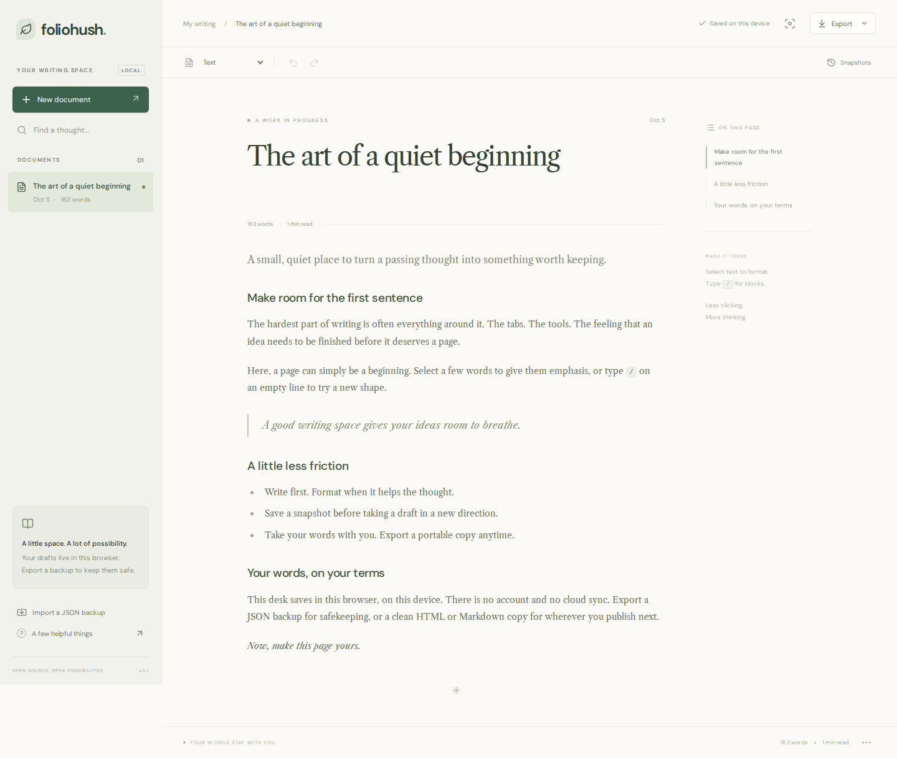

# Foliohush

**Немного тишины для следующей мысли.**

Foliohush — приложение для письма с локальным хранением, спокойной типографикой и редактором на React. Пишите черновики, сохраняйте важные версии и забирайте текст в JSON, Markdown или HTML.

[English](../README.md) · [简体中文](README.zh-CN.md) · Русский · [Deutsch](README.de.md)

[Онлайн-демо](https://loufengzh.github.io/foliohush/) · [GitHub](https://github.com/loufengzh/foliohush) · [CI](https://github.com/loufengzh/foliohush/actions/workflows/ci.yml) · [Мобильный скриншот](screenshots/mobile.png)



## Возможности

- **Удобное место для текста.** Список документов, поиск по заголовкам, оглавление, режим сосредоточенной работы, счётчик слов и примерное время чтения.
- **Форматирование рядом с текстом.** Выделите фрагмент, чтобы применить полужирный шрифт, курсив, зачёркивание, подсветку, встроенный код или ссылку. Меню блоков и `/` в пустом абзаце позволяют добавить заголовки, списки, цитаты, блоки кода и разделители.
- **Снимки версий.** Сохраняйте именованные снимки вручную. Перед восстановлением старой версии текущий черновик сохраняется отдельным снимком. У документа остаются последние 12 снимков.
- **Автосохранение в браузере.** Документы и снимки хранятся в `localStorage`. Ошибки сохранения показываются пользователю; повреждённые или несовместимые данные не перезаписываются незаметно. Перед записью проверяется ожидаемое содержимое хранилища; при наличии Web Locks вкладки координируются через блокировку. Обнаруженный конфликт приостанавливает сохранение.
- **Переносимые файлы.** JSON сохраняет документ со снимками, а Markdown и HTML подходят для чтения и последующей публикации. Проверенный JSON всегда импортируется как новый документ. При ошибке сохранения аварийный экспорт TXT позволяет забрать текущий текст редактора.
- **Компонент для повторного использования.** Исходный код `FolioEditor` предоставляет типизированные обработчики, настраиваемую подсказку и режим только для чтения.

Это единый репозиторий приложения, а не опубликованный npm-пакет компонента. Интерфейс пока на английском; этот файл переводит документацию, а не сам интерфейс.

## Локальный запуск

Нужны **Node.js 22.12 или новее** и npm. В приложенном процессе CI используется Node 24.

В каталоге репозитория выполните:

```sh
npm ci
npm run dev
```

Откройте адрес, который выведет Vite, обычно `http://127.0.0.1:5173`. Учётная запись, API-ключ и серверная часть не нужны. Для установки требуются зависимости; шрифты входят в сборку через Fontsource и не загружаются из внешнего CDN во время работы.

Сборка и её локальная проверка:

```sh
npm run build
npm run preview
```

Результат находится в `dist/` и подходит для статического веб-хостинга. `npm run preview` служит для проверки сборки, а не для рабочего сервера. Изменение протокола, имени хоста или порта создаёт отдельную область хранения браузера.

## Как писать

1. Нажмите **New document** и задайте заголовок.
2. Пишите текст. При выделении появится плавающая панель форматирования.
3. Введите `/` в пустом абзаце. Отфильтруйте блоки по названию, выберите стрелками, подтвердите Enter или закройте меню клавишей Escape.
4. Перед большой правкой откройте **Snapshots**, укажите название и нажмите **Save snapshot**.
5. Выберите **Export → Full-fidelity backup**, чтобы скачать текущий документ вместе со снимками в JSON. Для нескольких документов повторите экспорт по одному.
6. **Import a JSON backup** загрузит резервную копию как отдельный новый черновик.

| Действие                     | Клавиши             |
| ---------------------------- | ------------------- |
| Полужирный текст             | Ctrl/⌘ + B          |
| Курсив                       | Ctrl/⌘ + I          |
| Отмена                       | Ctrl/⌘ + Z          |
| Режим сосредоточенной работы | Ctrl/⌘ + Shift + F  |
| Меню блоков                  | `/` в пустом абзаце |

Слова считаются по пробельным разделителям. Время чтения оценивается исходя из 220 слов в минуту, минимум — одна минута. Для языков без пробелов между словами эти показатели особенно приблизительны.

## Держите копию вне браузера

**Хранилище браузера — не резервная копия. Очистка данных сайта удаляет черновики и снимки. Учётных записей, облачной синхронизации и восстановления с сервера нет.** Другой браузер, профиль, устройство, хост или порт использует другое рабочее пространство. Приватный режим и политика браузера также могут ограничивать срок хранения.

- Регулярно экспортируйте важные документы в JSON и храните файлы под своим контролем. Один экспорт содержит выбранный документ, а не всю библиотеку.
- Снимки лежат там же, где черновик, и не спасают при потере устройства или очистке данных. При создании тринадцатого снимка самый старый удаляется; снимок перед восстановлением тоже учитывается в лимите 12.
- При надписи **Not saved** или предупреждении экспортируйте текст до закрытия или перезагрузки вкладки. Для несохранённого документа пункт **Export → Emergency plain text** скачивает текущий текст в TXT без форматирования и снимков. Автоматический повтор приостановленного сохранения не гарантируется.
- Не редактируйте одно пространство одновременно в нескольких вкладках. Перед записью приложение сравнивает хранилище с последними прочитанными или сохранёнными байтами и использует `navigator.locks`, если этот API доступен. Без Web Locks остаётся только оптимистическая проверка; гонка между одновременными записями возможна. При конфликте сохранение останавливается, автоматического слияния нет.
- Уже загруженная вкладка позволяет писать без сети. Service Worker и устанавливаемой PWA нет, поэтому открытие или перезагрузка размещённого приложения без сети не гарантируется.
- Локальные данные и экспортированные файлы не шифруются приложением. Программы с доступом к профилю браузера или файлам могут их прочитать.

## Границы приложения

Foliohush предназначен для **текстовых материалов**: абзацев, заголовков уровней 1–3, маркированных и нумерованных списков, цитат, кода, разделителей и встроенного форматирования. Изображения, вложения, таблицы, встраиваемые материалы, совместная работа, аккаунты для публикации, ИИ-сервисы и импорт файлов Markdown/HTML не поддерживаются. В текущем интерфейсе также нет удаления документов и экспорта всего пространства одним файлом.

В пространстве помещается до **50 документов**, по **12 снимков** в каждом. Сериализованное пространство и каждый JSON-файл импорта/экспорта ограничены **4 МиБ**. Лимит самого браузера может быть ниже; снимки занимают часть общего объёма. Это защитные ограничения, а не гарантия быстрой работы около предела.

Редактор проверяет изменяющие документ транзакции до применения и отклоняет неподдерживаемые правки с уведомлением. Импорт принимает только версионированный формат Foliohush, проверяет узлы, атрибуты и сложность документа. Допустимы только абсолютные ссылки `http:`, `https:` и `mailto:`. Проверка снижает риск, но не подтверждает безопасность сайта по ссылке. Идентификатор импортированного документа создаётся заново, поэтому ID из файла не используется для замены существующего черновика.

Markdown не передаёт все детали оформления: подчёркивание и подсветка теряют стиль, сохраняя текст; буквенные и римские маркеры списков становятся числами. Формат документа допускает начало списка с 0 и маркеры `1`, `a`, `A`, `i`, `I`; JSON и HTML сохраняют эти атрибуты. HTML сохраняет поддерживаемое форматирование в самостоятельной странице без стилей приложения. Эти форматы не содержат снимки и не импортируются обратно через интерфейс. Для восстанавливаемой копии используйте JSON.

## Разработка и проверки

```sh
npm run typecheck
npm test
npm run build
npx playwright install chromium
npm run test:e2e
```

В Linux могут понадобиться системные зависимости браузера: `npx playwright install --with-deps chromium`. В [проверенном запуске CI](https://github.com/loufengzh/foliohush/actions/runs/37284170780) для коммита `b435db1` прошли все 24 теста Chromium: настольные и с мобильной эмуляцией. В онлайн-демо также проверены выделение текста, ссылки и перезагрузка на компьютере; настольные и мобильные скриншоты просмотрены. Границы проверки указаны в [отчёте, английский](verification.md). Для последующих коммитов нужен собственный успешный CI.

- [Архитектура и интеграция компонента, английский](architecture.md)
- [Руководство для участников, английский](../CONTRIBUTING.md)
- [Безопасность, английский](../SECURITY.md)
- [Сторонние лицензии, английский](../THIRD_PARTY_NOTICES.md)

## Происхождение и лицензия

Оболочка приложения, стили, меню команд, работа со снимками, проверка данных и экспорт — код этого проекта. Редактор построен на [Tiptap](https://tiptap.dev) и [ProseMirror](https://prosemirror.net). React отвечает за интерфейс, Vite — за сборку, Lucide — за иконки. Шрифты DM Sans и Libre Caslon Text поставляются через Fontsource.

Дизайн вдохновлён просторными редакторскими интерфейсами. Foliohush не связан с Medium, не использует его фирменные материалы и не выдаёт технологии сторонних редакторов за собственные.

Оригинальный код распространяется по [лицензии MIT](../LICENSE), copyright 2026 loufengzh. Зависимости и шрифты сохраняют собственные лицензии; см. [сторонние уведомления](../THIRD_PARTY_NOTICES.md).

## Восемь вариантов оформления

Нажмите **Appearance** (палитра на верхней панели), чтобы выбрать Botanical, Parchment, Porcelain, Rosewater, Midnight, Forest, Ink или Espresso. Четыре светлые и четыре тёмные темы оформляют весь интерфейс: меню, диалоги, ссылки, код, выделение и индикаторы фокуса. Parchment и Forest используют курсивный заголовок; Porcelain и Ink — шрифт без засечек.

**Follow system** переключает Botanical / Midnight вслед за системой. Выбор хранится отдельно от документов и синхронизируется между вкладками одного источника. Документы, снимки и экспорт не изменяются. Если хранилище недоступно, тема действует в текущем сеансе, а панель сообщает, что настройка не сохранена. При печати используется тёмный текст на белом фоне.


## Помощник для письма

Кнопка со звёздочкой открывает помощника. Локальное форматирование и демонстрационный план работают без сети; пример не создан ИИ. Можно выбрать фрагмент, просмотреть предложение, принять или отклонить его и отменить изменение. Для настоящего ИИ нужен собственный серверный шлюз с ключом только на сервере и подтверждение отправки контекста. Публичная демоверсия не подключена к ИИ. См. [настройку и безопасность](AI_AGENT.md).
